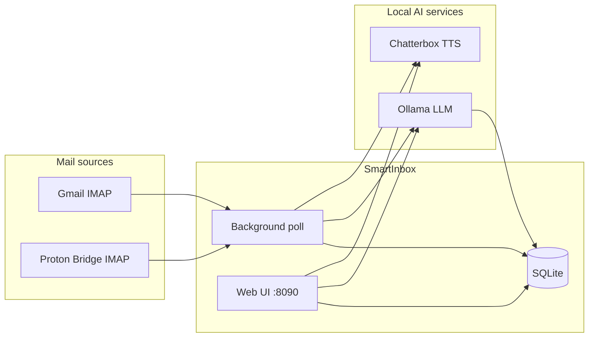

# SmartInbox

<p align="center">
  
</p>

Local-first inbox monitor that checks Gmail and Proton Mail over IMAP, summarizes new messages with **Ollama**, and speaks alerts through **Chatterbox TTS**. The web UI shows a three-panel layout (Inbox, Summary, Activity Log) with many retro display themes for summaries.

**Created with Grok Build**

---

## What SmartInbox does



1. **Polls** connected mail accounts on a timer (default every 60 seconds).
2. **Imports** new unread messages into a local SQLite database.
3. **Summarizes** each new message with your chosen Ollama model (runs in the background so the inbox updates immediately).
4. **Speaks** voice alerts through Chatterbox when alert rules allow (important senders, cooldowns, mute rules, etc.).
5. **Streams** live updates to the browser over Server-Sent Events (SSE).

Your real mail credentials and message bodies stay on your machine. Nothing is sent to a cloud inbox API.

---

## Features

<p align="center">
  
  &nbsp;&nbsp;
  
</p>

<p align="center"><em>Mail stays on your machine · Summaries and voice run locally</em></p>

| Area | What you get |
|------|----------------|
| **Mail** | Gmail (IMAP + App Password) and Proton Mail (via Proton Bridge) |
| **Summaries** | Ollama markdown summaries; editable system prompt on the LLM tab |
| **Voice** | Chatterbox clone/predefined voices, delivery modes (Normal, Conspiracy, Panicky, Neurotic, Playful), optional LLM voice-summary prompt |
| **Inbox UX** | Star senders (double-click), up/down vote sender interest, junk styling for low scores |
| **Themes** | 18 summary display themes (CRT, mainframe, PacMail, C64, Macintosh, MailCraft, etc.) |
| **Demo mode** | Settings toggle shows clearly fake `[DEMO]` emails for screenshots |
| **Watermark** | **Empty** inbox sets a cutoff so older mail is skipped and marked read on the server |
| **Pages** | Inbox, Settings, LLM, Phrases, Senders |

---

## Requirements

### System

| Requirement | Notes |
|-------------|--------|
| **Python** | 3.10 or newer |
| **OS** | Linux recommended (Proton Bridge scripts target Debian/Ubuntu) |
| **Disk** | Small SQLite DB + cached TTS WAV files in `localrecordings/` |
| **Network** | Outbound IMAP (Gmail/Proton), local HTTP to Ollama and Chatterbox |

### Python packages (installed automatically)

Declared in `pyproject.toml`:

- `fastapi` — web API and pages
- `uvicorn[standard]` — ASGI server
- `httpx` — Ollama and Chatterbox HTTP clients
- `jinja2` — HTML templates
- `pyyaml` — `config.yaml` loading

Install everything with:

```bash
python3 -m venv .venv
.venv/bin/pip install -e .
```

### External services (you run these separately)

SmartInbox expects these to already be running on your machine:

| Service | Default URL | Required? | Purpose |
|---------|-------------|-----------|---------|
| **[Ollama](https://ollama.com/)** | `http://127.0.0.1:11434` | **Yes** (for summaries) | Local LLM summarization |
| **[Chatterbox TTS Server](https://github.com/devnen/Chatterbox-TTS-Server)** | `http://127.0.0.1:8004` | Optional* | Spoken alerts and test speak |

\*Voice alerts are disabled gracefully if Chatterbox is off or unreachable; summaries and the inbox still work.

---

## 1. Install and run Ollama

### Install

Follow [https://ollama.com/download](https://ollama.com/download) for your platform, or on Linux:

```bash
curl -fsSL https://ollama.com/install.sh | sh
```

### Pull a model

The example config uses `qwen2.5:3b` (fast, modest RAM). Pull it once:

```bash
ollama pull qwen2.5:3b
```

Other small models (`llama3.2:3b`, `gemma2:2b`, etc.) work if you select them on the **LLM** tab.

### Run Ollama

Ollama usually runs as a system service after install. Verify:

```bash
curl http://127.0.0.1:11434/api/tags
```

You should get JSON listing installed models. If not:

```bash
ollama serve
```

Leave it running (or enable the Ollama systemd service).

---

## 2. Install and run Chatterbox TTS (optional but recommended)

### Install

Clone and set up [Chatterbox-TTS-Server](https://github.com/devnen/Chatterbox-TTS-Server) per its README. Typical pattern:

```bash
git clone https://github.com/devnen/Chatterbox-TTS-Server.git
cd Chatterbox-TTS-Server
python3 -m venv .venv
.venv/bin/pip install -r requirements.txt
```

### Clone voice reference file

SmartInbox defaults to **clone** mode with a reference audio file name from `config.yaml` (example: `kryten2.mp3`). Place your reference MP3/WAV in the Chatterbox server’s reference-audio directory (see that project’s docs), or change `reference_audio_filename` in `config.yaml` to match a file Chatterbox already has.

### Run Chatterbox

Start the server on port **8004** (must match `chatterbox_tts.base_url` in config):

```bash
# From the Chatterbox-TTS-Server directory — exact command varies by version
.venv/bin/python server.py
```

Verify:

```bash
curl http://127.0.0.1:8004/health
# or the root/docs endpoint documented in Chatterbox-TTS-Server
```

In SmartInbox **Settings → Chatterbox voice**, use **Test speak** to confirm audio.

---

## 3. Gmail setup (IMAP + App Password)

SmartInbox does **not** use Google OAuth. You only need IMAP and an app password.

### One-time Gmail configuration

1. Enable IMAP: Gmail → **Settings → See all settings → Forwarding and POP/IMAP → Enable IMAP**.
2. Turn on [2-Step Verification](https://myaccount.google.com/signinoptions/two-step-verification).
3. Create an [App Password](https://myaccount.google.com/apppasswords): choose **Mail** and device **Other** (name it `SmartInbox`).
4. Copy the **16-character** password (spaces optional).

### Connect in SmartInbox

1. Open **http://127.0.0.1:8090/settings**
2. Enter Gmail address and app password
3. Click **Save & connect**

Use the **app password**, not your normal Gmail password. Credentials are stored only in `data/smartinbox.db` (local SQLite).

---

## 4. Proton Mail setup (optional)

Proton Mail requires **[Proton Mail Bridge](https://proton.me/mail/bridge)** on the same machine. SmartInbox talks to Bridge at `127.0.0.1:1143` (IMAP, STARTTLS).

### Automated install (Debian/Ubuntu)

Helper scripts are in `scripts/`:

```bash
# Install Bridge + dependencies (run as root)
sudo ./scripts/install-proton-bridge.sh

# One-time interactive login (run as your user)
./scripts/proton-bridge-login.sh
# Inside Bridge CLI: login, then info — note the IMAP password

# Keep Bridge running in the background
systemctl --user enable --now protonmail-bridge.service
loginctl enable-linger "$USER"
```

The `.deb` installer is gitignored; the install script can download it if missing.

### Connect in SmartInbox

1. Ensure Bridge is running (`127.0.0.1:1143` reachable).
2. **Settings → Proton Mail** — enter your Proton address and the **Bridge IMAP password** (from `info` in Bridge CLI), not your Proton account password.
3. **Save & connect**

---

## 5. Install and run SmartInbox

### Clone and configure

```bash
git clone https://github.com/datagod/SmartInbox.git
cd SmartInbox
cp config.example.yaml config.yaml
```

Edit `config.yaml` if your Ollama/Chatterbox URLs, model name, or voice settings differ from defaults.

### Python environment

```bash
python3 -m venv .venv
.venv/bin/pip install -e .
```

### Start the server

```bash
.venv/bin/smartinbox
```

Defaults: **http://127.0.0.1:8090**

Custom host/port:

```bash
.venv/bin/smartinbox --host 0.0.0.0 --port 8090
```

Or set `host` / `port` in `config.yaml`.

### Open the UI

| URL | Page |
|-----|------|
| http://127.0.0.1:8090/ | Inbox + Summary + Activity Log |
| http://127.0.0.1:8090/settings | Mail accounts, alerts, voice, demo mode |
| http://127.0.0.1:8090/llm | Ollama model and summary prompt |
| http://127.0.0.1:8090/phrases | Delivery phrase TTS cache |
| http://127.0.0.1:8090/senders | Sender interest scores |

On first launch, connect mail in **Settings**. The activity log shows inbox checks; green lines indicate poll status and watermark cutoff when set.

---

## Configuration reference

Config is loaded from the first file that exists:

1. `./config.yaml` (project root)
2. `~/.config/smartinbox/config.yaml`

See `config.example.yaml` for all keys. Important sections:

```yaml
port: 8090
host: "127.0.0.1"
timezone: America/New_York
data_dir: data

gmail:
  poll_interval: 60.0    # overridden by Settings UI
  max_fetch: 20

ollama:
  base_url: http://127.0.0.1:11434
  model: qwen2.5:3b
  timeout: 120
  prompts_dir: prompts

chatterbox_tts:
  enabled: true
  base_url: http://127.0.0.1:8004
  voice_mode: clone              # or predefined
  reference_audio_filename: kryten2.mp3
  cache_dir: localrecordings
  alerts_enabled: true
  alert_cooldown: 120
```

Many runtime preferences (poll interval, alert cooldown, voice, delivery mode, demo mode, watermark) are also stored in SQLite / `localrecordings/.event_voice.json` when changed in the UI.

---

## Using the app

### Inbox

- **Check now** — manual poll
- **Empty** — clears local inbox, sets watermark (skips older mail on future polls), marks server unread as read
- **Double-click** an email — star / unstar (stars mark sender as important)
- **▲ / ▼** — upvote or downvote sender (affects interest score and junk styling)
- Select an email to view **Summary** or **Original** in the center panel
- **Theme** dropdown — changes summary appearance only (great for screenshots)

### Demo mode (screenshots)

**Settings → Demo mode → On** replaces the inbox with six clearly labeled `[DEMO]` sample messages. Themes, summaries, starring, and voting still work. Live mail is hidden and voice alerts are suppressed until you turn demo mode off.

### Voice alerts

Configured under **Settings → Chatterbox voice**:

- Voice (clone or preset), TTS model, delivery mode
- Optional greet-by-name
- **Voice summary** — LLM rewrites what is spoken using a custom voice prompt
- **Important senders** — alert rules for starred/important vs other senders
- **Alert cooldown** — minimum seconds between spoken alerts

Cached audio is reused from `localrecordings/` when the same text is spoken again.

### LLM tab

- Choose Ollama model
- Edit the email **summary system prompt** (saved under `prompts/`)

---

## Project layout

```
SmartInbox/
├── config.example.yaml    # Template — copy to config.yaml
├── config.yaml            # Your local config (gitignored)
├── pyproject.toml         # Python package and dependencies
├── data/                  # SQLite DB (gitignored)
│   └── smartinbox.db      # Emails, settings, credentials
├── localrecordings/       # TTS cache (gitignored)
├── prompts/               # Saved LLM/voice prompts (gitignored)
├── scripts/
│   ├── check-no-secrets.sh
│   ├── install-proton-bridge.sh
│   └── proton-bridge-login.sh
└── smartinbox/            # Application code
    ├── core.py              # Polling, summaries, alerts
    ├── demo_data.py         # Sample emails for demo mode
    ├── web/                 # FastAPI server, templates, static assets
    └── ...
```

---

## Security and privacy

**Never commit secrets.** Before `git push`:

```bash
git status
./scripts/check-no-secrets.sh
```

| Path | Contains |
|------|----------|
| `data/smartinbox.db` | IMAP passwords, emails, summaries, settings |
| `config.yaml` | Local service URLs and preferences |
| `localrecordings/` | Generated speech audio |
| `prompts/` | Custom LLM/voice prompts |

SmartInbox binds to `127.0.0.1` by default. If you expose it on `0.0.0.0`, treat it as a trusted-network service only — there is no built-in login on the web UI.

---

## Troubleshooting

| Symptom | Things to check |
|---------|------------------|
| **No summaries** | `curl http://127.0.0.1:11434/api/tags` — is Ollama up? Model pulled? Activity log may show `Summary failed` or timeout. |
| **No voice alerts** | Chatterbox running on port 8004? **Settings → Voice alerts** enabled? Clone reference file exists on Chatterbox server? |
| **Gmail connect failed** | App password (not account password), IMAP enabled, 2FA on. |
| **Proton connect failed** | Bridge running? `systemctl --user status protonmail-bridge` — use Bridge IMAP password from `info`. |
| **UI frozen / slow** | Older builds could block on IMAP; restart SmartInbox. Very slow Ollama models increase summary delay (inbox still lists mail immediately). |
| **Old mail after Empty** | Watermark and mark-seen should skip re-import; check activity log for cutoff date. |
| **Demo inbox empty** | Toggle demo mode off/on in Settings to restore samples, or click **Empty** in demo mode to reset samples. |

Health check:

```bash
curl http://127.0.0.1:8090/api/health
```

---

## Development

```bash
.venv/bin/pip install -e .
.venv/bin/smartinbox --port 8090
```

After backend changes, restart the server. Static assets use cache-busting query strings in templates (`app.js?v=…`); hard-refresh the browser (`Ctrl+Shift+R`) after front-end changes.

---

## License

MIT — see repository for details.